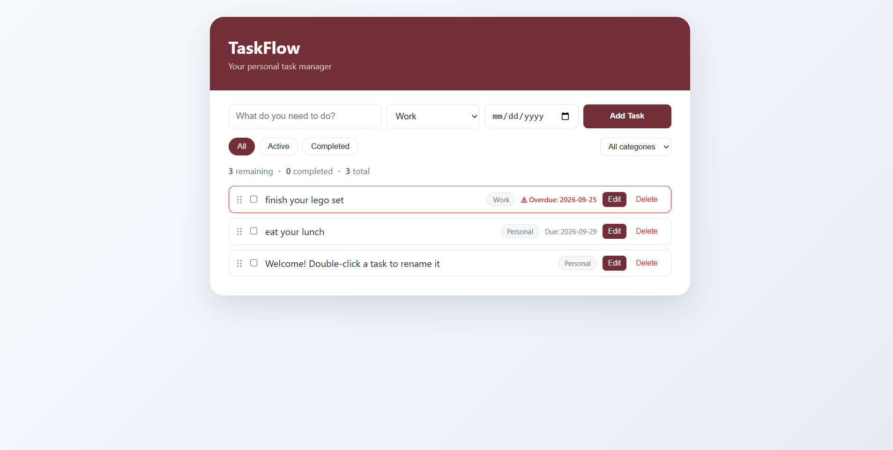
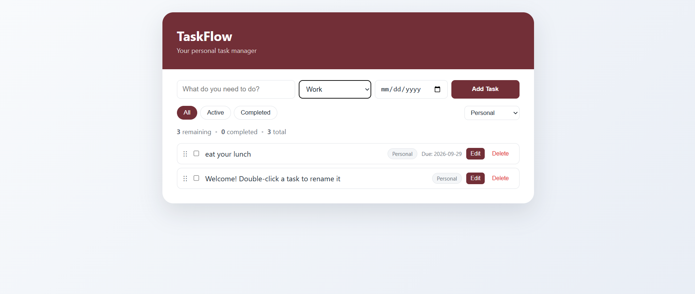
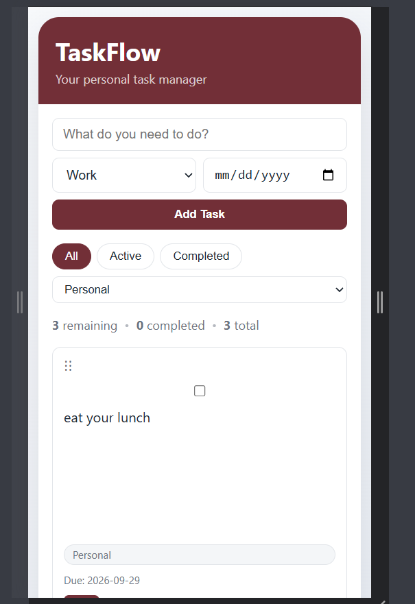

# TaskFlow

TaskFlow is a single-page React task manager for adding, organizing, and tracking daily to-dos. Tasks can be grouped into categories, filtered by status, given due dates, and reordered by drag-and-drop. Everything is saved in the browser's localStorage, so your tasks are still there after a page refresh.

## Features

**Core features**

- Add new tasks with a title, category, and optional due date
- Edit a task's title (double-click the title or press **Edit**, then press Enter or **Save**)
- Delete tasks
- Mark tasks as complete or active with a checkbox
- Filter tasks by status: **All**, **Active**, or **Completed**
- Organize tasks into categories (**Work**, **Personal**, **Urgent**) and filter by category
- Live count of remaining, completed, and total tasks
- Tasks persist in localStorage and survive a page refresh

**Extra features**

- Due dates with a red "Overdue" indicator for past-due, incomplete tasks
- Drag-and-drop reordering of tasks using the drag handle
- Form validation message when the task title is empty
- Loading state on first render and an empty state when no tasks match the current filters
- Responsive layout that works on desktop and mobile screens

## Technologies Used

- [React 19](https://react.dev/) (functional components and hooks only: `useState`, `useEffect`, `useMemo`, `useRef`)
- [Vite](https://vitejs.dev/) for the dev server and production build
- Plain CSS with CSS variables and flexbox (no UI framework)
- Browser localStorage API for data persistence
- [oxlint](https://oxc.rs/docs/guide/usage/linter) for linting

## Project Structure

```
taskflow/
├── public/
├── screenshots/
│   ├── Main_view.png
│   ├── Filtered_view.png
│   └── Mobile_view.png
├── src/
│   ├── components/
│   │   ├── Header.jsx       # App title bar
│   │   ├── TaskForm.jsx     # Controlled form for adding tasks
│   │   ├── FilterBar.jsx    # Status and category filters
│   │   ├── Stats.jsx        # Live remaining / completed / total counts
│   │   ├── TaskList.jsx     # Renders the task list, empty state, drag-and-drop
│   │   └── TaskItem.jsx     # A single task (complete, edit, delete, overdue)
│   ├── hooks/
│   │   └── useLocalStorage.js   # Custom hook that syncs state with localStorage
│   ├── App.jsx              # Holds the app state and connects all components
│   ├── App.css              # All styles
│   └── main.jsx             # React entry point
├── index.html
├── package.json
└── README.md
```

## Setup Instructions

**Prerequisites:** [Node.js](https://nodejs.org/) 20.19 or newer, and npm (included with Node.js).

1. Clone the repository and move into the project folder:

   ```bash
   git clone <repository-url>
   cd taskflow
   ```

2. Install dependencies:

   ```bash
   npm install
   ```

3. Start the development server:

   ```bash
   npm run dev
   ```

4. Open the local URL shown in the terminal (usually http://localhost:5173).

Other useful commands:

```bash
npm run build    # create a production build in the dist folder
npm run preview  # preview the production build locally
npm run lint     # check the code for problems
```

## Screenshots

**Main view** with tasks in different categories and an overdue task



**Filtered view** showing the status filter in use



**Mobile view** showing the responsive layout on a narrow screen



## Known Limitations

- The app has a single view, so React Router is not used.
- Drag-and-drop uses the browser's native drag events, so it works with a mouse but not reliably on touch screens.
- Categories are a fixed set (Work, Personal, Urgent); custom categories cannot be created.
- Tasks are stored only in the current browser's localStorage, so they are not shared between devices or browsers.
